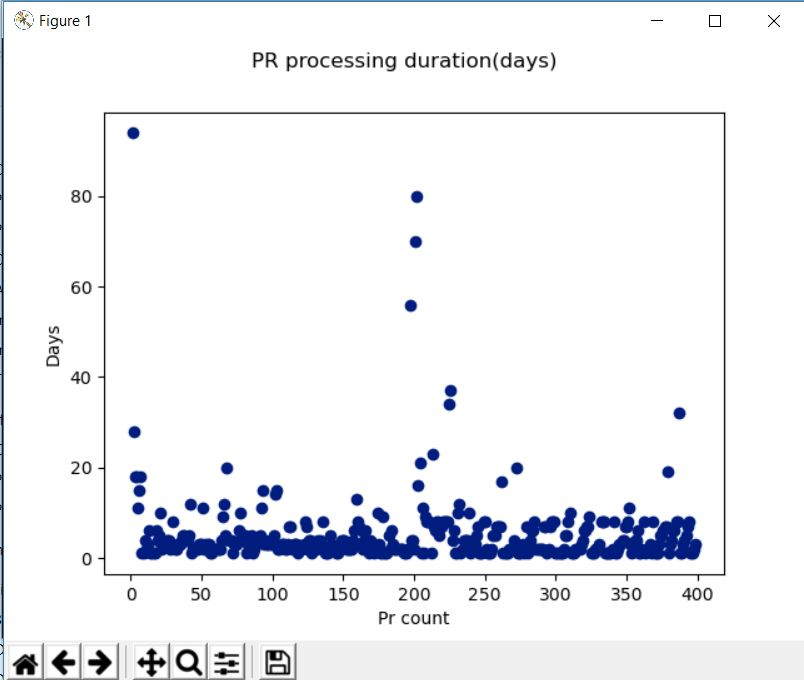

Data input: Purchase Request numbers along with days taken to process it.

Methodology: Z-score.

With Z-score we can define outliers relying on the data background(mean, standard deviation) instead of threshold set up front. Then, we are flexible enough to see what is the standard duration of processing PR and what is beyound the standard.

Outcome: script returns Puchare Requests that are related to outliers(days above standard duration) and a graph presenting outliers

As the following actions leaders can react on time and check what is the reason of processing PR longer than standardised duration. Finding the reason enables us to imporve the process to avoid similar delays.

